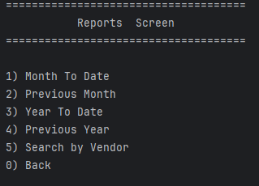
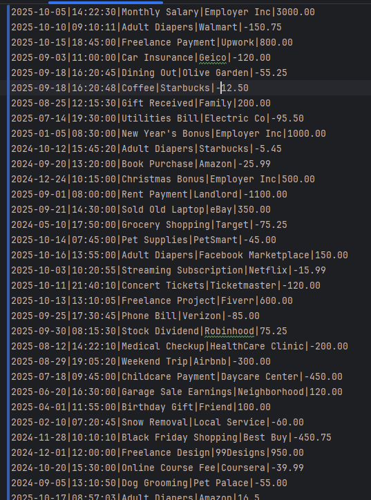

```

       _____________________   _____  ________       _____  ___________
       \______   \_   _____/  /  _  \ \______ \     /     \ \_   _____/
       |       _/|    __)_  /  /_\  \ |    |  \   /  \ /  \ |    __)_
       |    |   \|        \/    |    \|    `   \ /    Y    \|        \
       |____|_  /_______  /\____|__  /_______  / \____|__  /_______  /
       \/        \/         \/        \/          \/        \/
                        
                     ⠀⠀⠀⠀⠀⠀⠀⠀⠀⠀⠈⢳⠀⠀⠀⠀⠀⠀⠀⠀⠀⠀⠀⠀⠀⠀
                     ⠀⠀⠀⠀⠀⠀⠀⠀⠀⠀⣠⡾⡇⠀⢶⡀⠀⠀⠀⠀⠀⠀⠀⠀⠀⠀
                     ⠀⠀⠀⠀⠀⠀⠀⠀⣠⡾⢋⡼⠁⠀⣸⡇⠀⠀⠀⠀⠀⠀⠀⠀⠀⠀
                     ⠀⠀⠀⠀⠀⠀⠀⠀⣿⣳⠏⠀⣠⠞⣡⡏⠀⠀⠀⠀⠀⠀⠀⠀⠀⠀
                     ⠀⠀⠀⠀⠀⠀⠀⠀⢿⣿⡄⢸⣯⡾⠋⠀⠀⠀⠀⠀⠀⠀⠀⠀⠀⠀
                     ⠀⠀⠀⠀⠀⠀⠀⠀⠀⠙⠳⠸⡟⠁⠀⠀⠀⠀⠀⠀⠀⠀⠀⠀⠀⠀
                     ⠀⡀⢀⣀⣀⣀⣀⣀⣀⣀⣀⣀⣁⣀⣀⠀⠀⠀⠀⠀⠀⠀⠀⠀⠀⠀
                     ⢸⡟⠛⠛⠛⠛⠛⠛⠛⠛⠛⠛⠛⠛⠛⠛⠛⢻⢿⣷⢀⣀⣀⣀⡀⠀
                     ⢸⡇⠀⣶⢦⠀⠀⠀⠀⠀⠀⠀⠀⠀⠀⠐⠶⣒⣒⣿⣋⣥⣄⡉⢻⣆
                     ⢸⣿⠈⣇⣾⠀⠀⠀⠀⠀⠀⠀⠀⠀⠀⠀⠶⠶⢶⣿⠁⠀⢸⡇⢰⣿
                     ⠀⢻⣆⢻⣿⡄⠀⠀⠀⠀⠀⠀⠀⠀⠀⠀⠒⠒⣾⣯⣤⣴⠟⣡⣿⠃
                     ⠀⠈⢿⣎⠻⣷⡀⠀⠀⠀⠀⠀⠀⠀⠀⠀⠛⣿⣿⣭⣥⣴⡿⠟⠁⠀
                     ⠀⠀⠈⢿⣷⣄⠑⣦⡄⠀⠀⠀⣀⠀⢛⣻⣿⡟⠉⠉⠉⠀⠀⠀⠀⠀
                     ⠀⣴⡶⠶⠿⠿⢿⣶⣤⣤⣤⣤⣽⣿⠿⠛⣛⣟⣷⡆⠀⠀⠀⠀⠀⠀
⠀                     ⠛⠷⠶⣤⣤⣤⣤⣴⣾⣿⣿⣶⣦⣤⣶⣶⡾⠟⠁⠀⠀⠀⠀⠀⠀


```


# Accounting Ledger
## Features

- [ ] Add and save deposits
- [ ] Make payments 
- [ ] Display All entries 
- [ ] Display All Deposits
- [ ] Display All Payments
- [ ] Display Every Transaction This Month
- [ ] Display Every Transaction Last Month
- [ ] Display Every Transaction This Year
- [ ] Display Every Transaction Last Year
- [ ] Search Tranasactions By Vendor Name




Each menu prompts for user input which calls to a specific method



Transactions are saved in a file to call to later

```
public static void monthToDate() {
    LocalDate today = LocalDate.now();
    LocalDate firstOfYear = today.withDayOfYear(1);
    System.out.println("Month to Date Transactions: \n");
    for (Transaction transaction : transactions) {
        LocalDate transactionDate = LocalDate.parse(transaction.getDate());
        if(!transactionDate.isBefore(firstOfYear) && !transactionDate.isAfter(today)) {
        System.out.println(transaction.getDate() + " " + transaction.getVendor() + " " + transaction.getAmount() + "\n");
        }
    }
}
```
^
This block of code is reusable for any methods that check from a specific date to today.

>A new screen that allows the user to run pre-defined reports or to run a custom search (Reports)
1) Month-to-date
2) Previous month
3) Year-to-date
4) Previous Year
5) Search by Vendor
0) Back